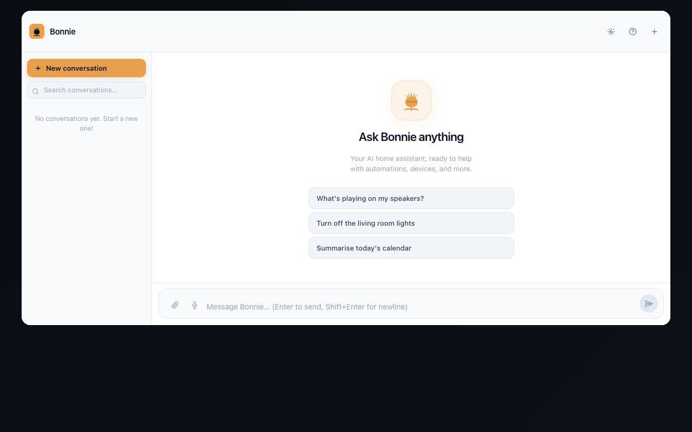
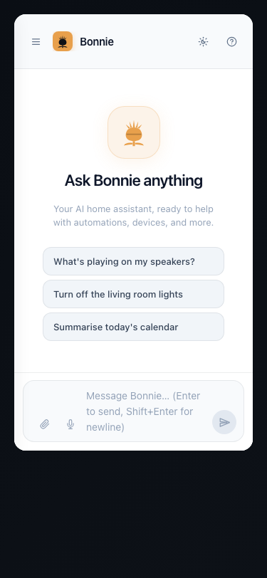

# bonnie-ai-card

**Native Home Assistant Lovelace card for AI chat** -- LitElement, SSE streaming, tool-use display, TTS, conversation management.


---

## Overview

A custom Home Assistant Lovelace card for chatting with a [ClaudeHA](https://github.com/CaputoDavide93/ClaudeHA) backend. Built as a native web component using LitElement and TypeScript, it integrates directly with HA's theming system -- no iframes, no cross-origin issues.

The card provides a full-featured AI chat interface with SSE streaming, markdown rendering, tool-use visualization, voice input/output, and conversation management.

## Screenshots




## Features

### Chat Interface
- **SSE streaming** -- real-time response streaming with markdown rendering (marked + highlight.js)
- **Tool-use display** -- collapsible cards showing AI tool invocations (admin only)
- **Multi-conversation sidebar** -- create, switch, rename, delete, and export conversations
- **Drag-drop file upload** -- image, PDF, and text file support
- **Keyboard shortcuts** -- quick actions for power users

### Voice
- **Web Speech TTS** -- text-to-speech for responses
- **Web Speech STT** -- voice input via browser speech recognition
- **Kiosk mode** -- optimized for touchscreen kiosk displays

### Administration
- **Settings panel** -- tone, language, model selector, system prompt per conversation
- **Memory CRUD** -- manage persistent user facts
- **User admin** -- user management for multi-user setups
- **Plugin admin** -- plugin registry management
- **Proactive rules admin** -- configure entity monitoring rules
- **Notification center** -- proactive monitoring alerts
- **Analytics dashboard** -- usage metrics and conversation stats

### Internationalization
- **i18n** -- English and Italian language support
- **Export** -- conversations exportable as Markdown or JSON

## Installation

<details>
<summary><b>HACS (recommended)</b></summary>

1. Make sure [HACS](https://hacs.xyz) is installed.
2. Go to **HACS -> Frontend -> + Explore & Download Repositories**.
3. Search for **Bonnie AI Card** and install it.
4. Reload the browser.
5. Add the card to your dashboard (see Configuration below).

</details>

<details>
<summary><b>Manual install</b></summary>

1. Download `bonnie-ai-card.js` from the [latest release](../../releases/latest).
2. Copy it to `/config/www/bonnie-ai-card.js` on your Home Assistant instance.
3. Go to **Settings -> Dashboards -> Resources** and add:
   - URL: `/local/bonnie-ai-card.js`
   - Resource type: `JavaScript module`
4. Reload the browser.

</details>

## Configuration

Add the card to any Lovelace dashboard in YAML mode:

```yaml
type: custom:bonnie-ai-card
backend_url: http://<your-bonnie-host>:7788
kiosk_token: "your-kiosk-token-here"
title: "Bonnie"
height: 600
```

### Options

| Option | Type | Required | Default | Description |
|--------|------|----------|---------|-------------|
| `backend_url` | `string` | Yes | -- | ClaudeHA backend URL (no trailing slash) |
| `kiosk_token` | `string` | Yes | -- | Kiosk token for auto-login via `/api/auth/kiosk-exchange` |
| `title` | `string` | No | `"Bonnie AI Chat"` | Card header title |
| `height` | `number \| string` | No | `auto` | Card height in px or any CSS length |
| `model` | `string` | No | -- | Model name passed to the chat API |

## Tech Stack

| Component | Technology |
|-----------|------------|
| Framework | Lit 3.2 (LitElement) |
| Language | TypeScript 5.5 |
| Bundler | Rollup 4.x |
| Markdown | marked 12.x |
| Syntax highlighting | highlight.js 11.x |
| Minification | @rollup/plugin-terser |

## Development

```bash
git clone https://github.com/CaputoDavide93/bonnie-ai-card.git
cd bonnie-ai-card

npm install

# Build once
npm run build

# Watch mode (rebuilds on change)
npm run watch
```

The built file is output to `dist/bonnie-ai-card.js`. Copy it to your HA `/config/www/` directory for testing.

## Project Structure

```
bonnie-ai-card/
  src/
    bonnie-card.ts      # Main card component (LitElement)
    card-editor.ts      # Visual editor for card configuration
    api.ts              # Backend API client (auth, chat, SSE)
    styles.ts           # CSS styles (HA theme integration)
    markdown.ts         # Markdown rendering utilities
    i18n.ts             # Internationalization (EN/IT)
    types.ts            # TypeScript type definitions
  dist/                 # Built output
  rollup.config.js      # Rollup bundler configuration
  tsconfig.json         # TypeScript configuration
  hacs.json             # HACS integration manifest
  package.json
```

## Backend Requirement

This card requires a running [ClaudeHA](https://github.com/CaputoDavide93/ClaudeHA) backend. The backend must have the kiosk-exchange auth endpoint enabled and a kiosk token configured.

## Related Projects

| Project | Description |
|---------|-------------|
| [ClaudeHA](https://github.com/CaputoDavide93/ClaudeHA) | AI backend (FastAPI + Claude Code CLI) |
| [BonnieAssistant](https://github.com/CaputoDavide93/BonnieAssistant) | Scottish voice assistant (TTS + Sonos) |
| [HA_Dashboard](https://github.com/CaputoDavide93/HA_Dashboard) | Home Assistant configuration and dashboard |

## License

[MIT](LICENSE) -- Davide Caputo
